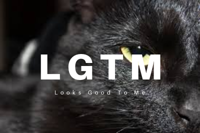

# lgtm
Commands for generating LGTM image.
This work is greatly inspired by [lgtmoon](https://github.com/yoshikyoto/lgtmoon).




## usage
1. first, copy the input image to the clipboard.
2. then, run this command, lgtm image is copied to the clipboard.
```
lgtm
```
other usages
```
# from stdin
curl http://example.com/image.png | lgtm-convert | imc

# from file
lgtm-convert /path/to/image.png | imc
```

## setup
```
1. install imagemagick and pngpaste
```
brew install imagemagick pngpaste
```

2. install impbcopy (http://www.alecjacobson.com/weblog/?p=3816)
```
wget https://gist.githubusercontent.com/beng/806b8420cc16bcf8a07a/raw/2e4e02c30d157a9908001ad8029cbdd3385f5851/impbcopy.m
gcc -Wall -g -O3 -ObjC -framework Foundation -framework AppKit -o impbcopy impbcopy.m
cp impbcopy /usr/local/bin/  # or other path in PATH
```

3. install lgtm
```
git clone git@github.com:yuyamada/lgtm.git ~/.lgtm
source ~/.lgtm/lgtm.sh  # recommend to append this to rcfile
```

## reference
- https://github.com/yoshikyoto/lgtmoon
- https://dotcolon.net/font/aileron/
- http://www.alecjacobson.com/weblog/?p=3816
- https://gist.github.com/beng/806b8420cc16bcf8a07a
